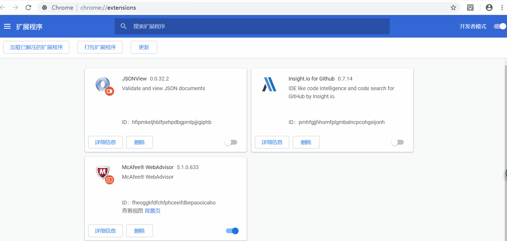

# ImagesPack
> ImagesPack是一个用于将网页中的图片打包下载的chrome插件

## build
1. git clone https://github.com/fanxq/ImagesPack.git or download zip
2. cd "path to where you store this project"
3. npm install
4. npm run build

## Installation
build成功后，项目中将会产生一个名为“out”的文件夹，里面存放着构建好的插件。然后按照下图所示安装并使用该插件。

